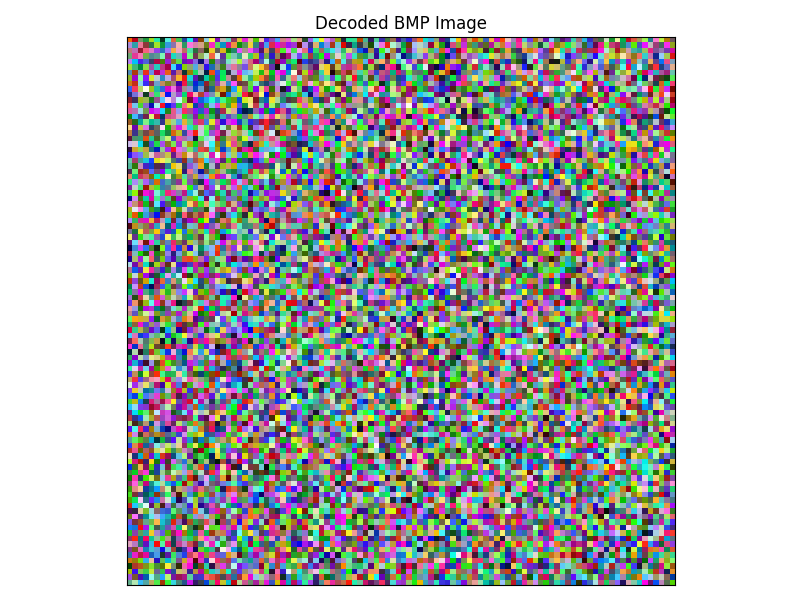
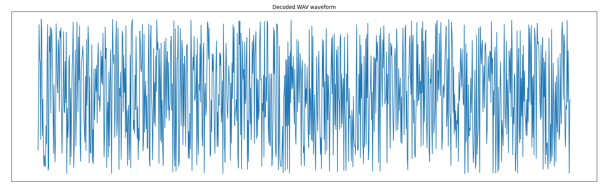
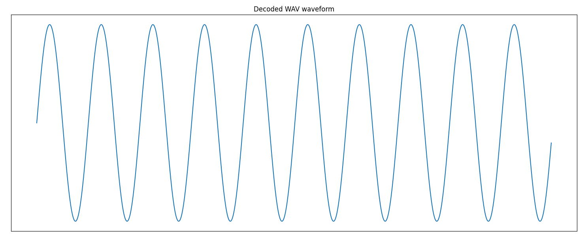
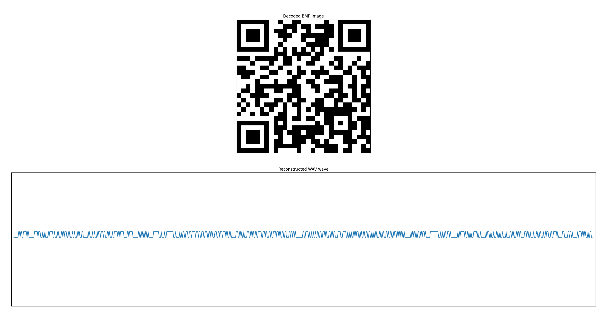
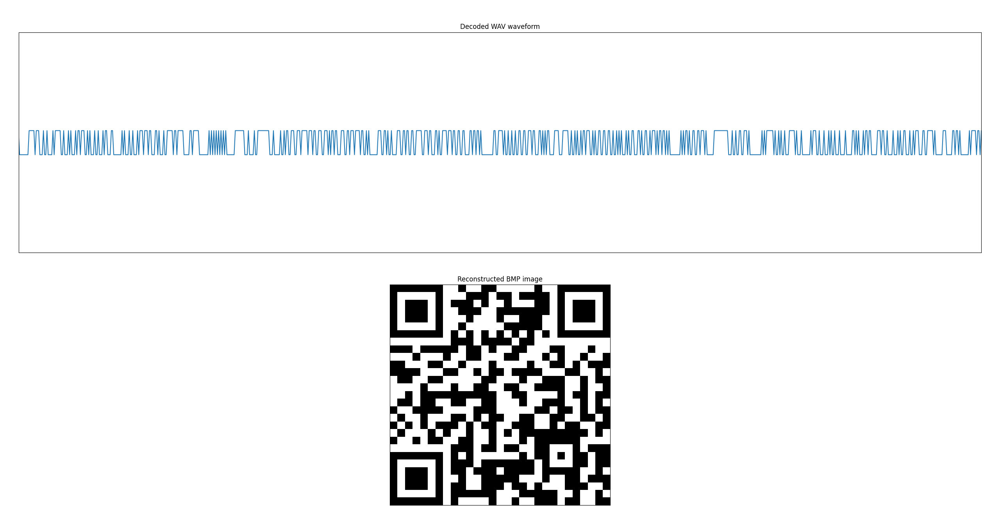
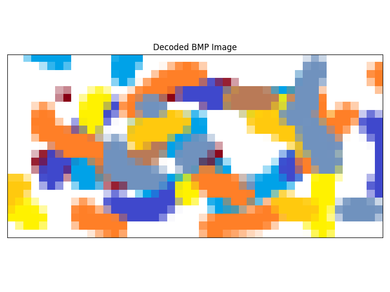
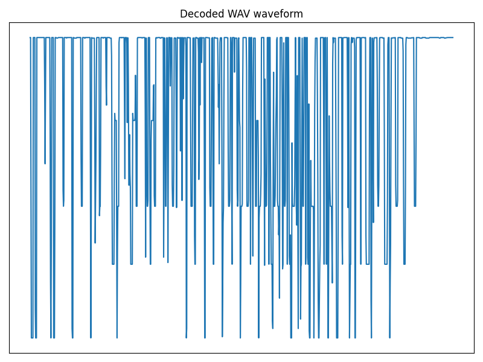

# BMP2WAV Converter

## Converter Features

Functions provided by the application and the technological capabilities that enable bidirectional conversion between image and sound data, their generation, and visualization.

---

### Random Image Generation

The application allows you to generate random raster BMP images with a defined width and height.



#### Features

* The resolution is defined by the user using width and height in pixels.
* Color components (R, G, B) are generated independently for each pixel.
* Output format is 24-bit uncompressed BMP.
* Usage: The output image can be used as input for conversion to WAV or as a test file.

#### Command Line Parameters

```bash
py ./main.py -gb <width> <height> <output_path> [--show -s] [--show-with-axes -sx] [--test]
```

#### Optional Flags

* `-s`: Display the generated image.
* `-sx`: Display the image with axes.
* `--test`: Save the preview to the test folder.

#### Example Usage

```bash
py ./main.py -gb 100 100 ./content/media/out/random.bmp -s
```

---

### Random Sound Generation

The application allows you to generate a random WAV sound signal.



#### Features

* The duration is defined by the number of samples.
* Sampling rate: 44,100 Hz.
* Number of channels: 1 (mono).
* Bit depth: 32-bit per sample.
* Output format: WAV PCM (uncompressed).

#### Command Line Parameters

```bash
py ./main.py -gw <samples> <output_path> [--show -s] [--show-with-axes -sx] [--test]
```

#### Optional Flags

* `-s`: Display the waveform.
* `-sx`: Display the waveform with axes.
* `--test`: Save the preview to the test folder.

#### Example Usage

```bash
py ./main.py -gw 1000 ./content/media/out/random_wave.wav -s
```

---

### Sine Wave Generation

The application can generate a pure sine wave signal in WAV format.



#### Features

* Frequency is user-defined.
* Sampling rate: 44,100 Hz.
* Number of samples: user-defined.
* Channels: 1 (mono).
* Bit depth: 32-bit per sample.
* Output format: WAV PCM (uncompressed).

#### Command Line Parameters

```bash
py ./main.py -gw <samples> <output_path> -f <frequency> [--show -s] [--show-with-axes -sx] [--test]
```

#### Example Usage

```bash
py ./main.py -gw 1000 ./content/media/out/sine_wave.wav -f 440 -s
```

---

### BMP to WAV Conversion

The application supports conversion from BMP raster images to WAV audio files.



#### Features

* Supported BMP formats: 1-bit, 4-bit, 8-bit, 24-bit.
* Output WAV:

  * Sampling rate: 44,100 Hz.
  * Bit depth: 32-bit.
  * Mono.

#### Command Line Parameters

```bash
py ./main.py --convert <input.bmp> <output.wav> [--show -s] [--show-with-axes -sx] [--test]
```

#### Example Usage

```bash
py ./main.py --convert ./content/media/bmp/1bit.bmp ./content/media/out/1bit.wav -s
```

---

### WAV to BMP Conversion

The application allows converting WAV audio files back into BMP raster images.



#### Features

* Converts amplitude values back to RGB pixel values.
* Reconstructs the original image resolution.

#### Command Line Parameters

```bash
py ./main.py --convert <input.wav> <output.bmp> [-c width height] [--show -s] [--show-with-axes -sx] [--test]
```

#### Example Usage

```bash
py ./main.py --convert ./content/media/out/1bit.wav ./content/media/out/1bit.bmp -s
```

---

### File Data Visualization

The application allows visualizing data from WAV and BMP files.




#### Command Line Parameters

```bash
py ./main.py -i <file.wav or file.bmp> [--show -s] [--show-with-axes -sx] [--test]
```

#### Example Usage

```bash
py ./main.py -i ./content/media/bmp/24bit.bmp -s
```
